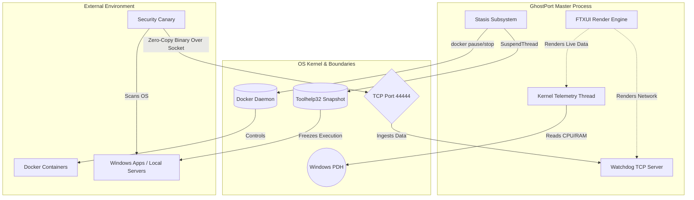

<div align="center">
  
# 🛡️ GhostPort OS
**Advanced Development Environment Security & Telemetry Engine**

[](https://en.cppreference.com/w/)
[](https://microsoft.com)
[](https://docker.com)
[](https://cmake.org/)
[](https://opensource.org/licenses/MIT)

_A multi-threaded, native C++ daemon for Zero-Copy Port Reaping, Kernel-level Thread Suspension, and Docker Container Management._

---

</div>

## 📖 Overview

**GhostPort OS** is a high-performance terminal utility engineered to solve the most frustrating bottlenecks in local software development: runaway memory leaks, locked network ports, and aggressive background containers eating CPU cycles.

Built entirely in C++ with a multi-process architecture, GhostPort bypasses standard task managers by hooking directly into the Windows Kernel Scheduler, zero-copy TCP sockets, and the Docker command-line interface—all wrapped in a highly responsive, custom Terminal UI (TUI).

<details>
<summary><b>📋 Table of Contents (Click to Expand)</b></summary>

1. [Core Features](#-core-features)
2. [System Architecture](#-system-architecture)
3. [Global Deployment (Installation)](#-global-deployment)
4. [The Tech Stack](#-the-tech-stack)
5. [Usage & Modules](#-usage--modules)
6. [License](#-license)
</details>

---

## ⚡ Core Features

- 📊 **Live Kernel Telemetry:** Streams real-time physical RAM utilization and CPU execution cycles directly from the Windows Performance Data Helper (PDH) API.
- 🌐 **Zero-Copy Network Reaper:** Deploys a silent background network Canary over a Localhost IPC socket to detect bound development ports (React, Node, XAMPP, Spring Boot).
- 🐳 **Docker Poltergeist:** Hijacks the Docker daemon via OS pipelining (`popen`) to gracefully manage, monitor, and spin down detached containers.
- ❄️ **The Stasis Chamber (Cryo-Sleep):** Halts CPU execution cycles without killing the process. Freezes Docker containers via Linux `cgroups` and native Windows UI apps via the `SuspendThread` Kernel API.
- 🚨 **Memory Leak Threat Analyzer:** A background heuristic engine that continuously monitors port states and triggers visual UI alerts for runaway RAM consumption.

---

## 🏗 System Architecture

GhostPort operates on a multi-threaded architecture, separating UI rendering from Kernel polling and IPC bridging to ensure 0ms input latency even under heavy system load.



## 🚀 Global Deployment

GhostPort is designed to be injected directly into your Operating System. Instead of navigating to a specific folder every time you need it, this deployment protocol permanently registers the optimized C++ binary to your system, allowing you to summon it from _any_ terminal, at _any_ time.

### Prerequisites

- **Windows 10/11** (Core OS architecture requirement)
- **Docker Desktop** (Optional, required only for Poltergeist features)
- **MSVC Compiler & CMake** (If building from source)

### Step-by-Step Installation Protocol

**Step 1: Clone the Repository**
Open your terminal and pull the source code to your local machine:

```bash
git clone [https://github.com/NimnaOfficial/GhostPort.git](https://github.com/NimnaOfficial/GhostPort.git)
cd GhostPort
```

**2. Compile the Optimized Release Build**
Using CMake, ensure you build the **Release** variant (not Debug).

> **Under the Hood:** Debug builds contain bloated tracking code that severely slows down execution. Compiling the Release build strips this away, resulting in a lightweight, blazing-fast binary optimized for real-time monitoring.

**3. Execute the DevOps Deployment Script**
Open a PowerShell terminal as an **Administrator** and run the automated installation script:

```powershell
.\deploy.ps1
```

> **What this does:** The script creates a secure `GhostPort` directory inside your hidden Windows `%LocalAppData%` folder, migrates the optimized `.exe` into it, and safely edits your Windows Environment Registry (`PATH`) to recognize the application globally.

**4. Verify OS Injection**
Completely close all active terminals. Open a brand new Command Prompt, PowerShell, or VS Code terminal anywhere on your PC and type:

```bash
ghostport
```

_If the Terminal UI launches instantly, your deployment was a complete success._

---

## 💻 Usage & Subsystems

GhostPort operates through four highly specialized modules. You can seamlessly navigate between them using the `Tab` or `Arrow` keys.

### 📊 1. The Dashboard (Telemetry Engine)

- **Objective:** Provides a real-time, split-screen visual matrix of your CPU execution cycles (Cyan) and physical RAM utilization (Magenta).
- **Interaction:** Launch GhostPort. The telemetry engine automatically starts as a detached, asynchronous background thread.
- **Why it's Elite (Systems Engineering):** Standard task managers use high-level, bloated software wrappers to guess performance metrics. GhostPort hooks directly into the **Windows Performance Data Helper (PDH) Kernel API**, pulling raw, highly accurate hardware metrics with virtually zero system overhead.

### 🌐 2. The Port Reaper (Network Security)

- **Objective:** Scans your localhost environment for locked, active, or runaway development ports (e.g., Node.js, PHP, React, MySQL) and terminates them on command.
- **Interaction:** Hit **Deploy Security Canary**. The engine scans common development ports. Use the arrow keys to lock onto a target and hit **Terminate Selected Port**.
- **Why it's Elite (Systems Engineering):** It features a background **Threat Analyzer** algorithm that continuously monitors array states to flag memory leaks. When terminating, it bypasses standard permission layers by executing an OS-level `SIGKILL` subprocess, forcefully terminating the specific Process ID (PID) tied to the socket without requiring a PC reboot.

### 🐳 3. Docker Poltergeist (Container Management)

- **Objective:** Gives you direct, rapid-fire terminal control over your active Docker environments without waiting for the heavy Docker Desktop GUI to load.
- **Interaction:** Hit **Scan Docker Subsystem** to instantly populate a list of active containers. Lock onto a target and hit **Graceful Spin Down**.
- **Why it's Elite (Systems Engineering):** GhostPort utilizes C++ OS Pipelining (`popen`) to silently hijack the Docker command-line interface in the background. It parses the raw output streams directly into the UI and issues native `SIGTERM` commands, ensuring databases shut down safely without data corruption.

### ❄️ 4. The Stasis Chamber (Cryo-Sleep)

- **Objective:** The ultimate development utility. It physically halts the execution of heavy applications, dropping their CPU usage to `0.0%` while keeping all your session data safely frozen in your RAM.
- **Interaction:** Toggle the radar between the _Docker Subsystem_ and the _Windows OS Kernel_. Hit **Scan**, select a heavy background application, and hit **Initiate Cryo-Sleep**. When you are ready to resume work, hit **Thaw Sequence**.
- **Why it's Elite (Systems Engineering):** Standard OS task managers only allow you to _kill_ a process, destroying your active session. The Stasis Chamber uses advanced Kernel magic: it commands Linux `cgroups` to freeze Docker containers, and utilizes native **Windows Toolhelp32 API / SuspendThread** commands to physically freeze OS execution threads at the kernel scheduler level.
